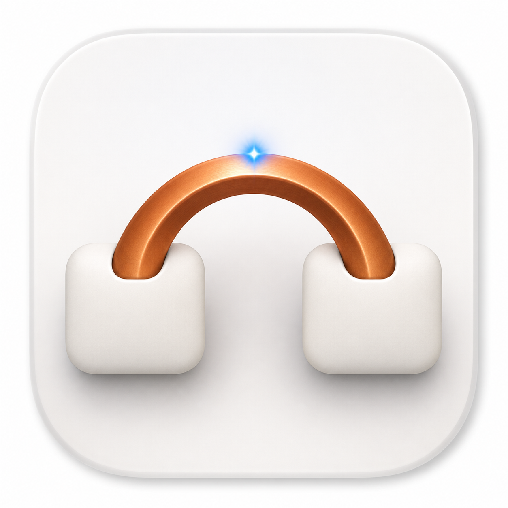

# Copper Reconstruction

<p align="center">
  
</p>

A private, local-first reconstruction of Copper's observable macOS experience
for personal use.

Copper's core product loop is:

```text
Capture selected text from any app
                 ↓
Organise notes and queue future prompts
                 ↓
Copy them back into the active AI workflow and mark them done
```

## Current status

The native macOS reconstruction is implemented as a Swift Package executable.
The app is local-first and runs from a floating companion panel; the tested
bundle is built at `.build/Copper.app` and can be installed at
`/Applications/Copper.app`.

Production uses a regular macOS activation policy so Copper has a Dock icon and
appears in Command-Tab, while the visible companion remains a floating,
nonactivating `NSPanel` during capture. Its native shell is draggable and
resizable (`320×420` minimum, `430×760` first-launch size, `620` maximum width)
and restores its frame between launches. The standard traffic lights remain
hidden to match the public reference; `⌘W`, `⌘M` and `⌘0` hide, minimise and
restore the panel.

## Product scope

The first usable version should provide:

- a compact floating macOS companion window;
- global selected-text capture, initially through double `Shift`;
- sections, search, Markdown previews and a bottom composer;
- single and multi-selection;
- copy, numbered-list copy, completion, editing, merging and moving notes;
- customisable keyboard shortcuts;
- local-only persistence with no account, sync, analytics or note telemetry.

The canonical implementation spec is
[`.scratch/copper-reconstruction/spec.md`](.scratch/copper-reconstruction/spec.md).
The detailed product evidence, visual targets and unknowns are in
[the product analysis](docs/product-spec.md).
The app/site privacy boundary is recorded in [docs/privacy.md](docs/privacy.md).

## Architecture direction

This is a native macOS product. The implementation direction is:

- **SwiftUI** for the cards, sections, search, composer and settings;
- **AppKit interop** for `NSPanel`/`NSWindow`, contextual menus and precise
  window behaviour;
- macOS **Accessibility APIs** for reading selected text;
- `NSPasteboard` for clipboard output;
- a local file for persistence.

The shadcn/ui checkout under `.opensrc/` is a useful open-code design reference,
but it is a React/web component system and is not the runtime foundation for a
native macOS app. See
[ADR-0001](docs/adr/0001-native-macos-architecture.md).

## Repository map

```text
.
├── docs/
│   ├── adr/
│   │   └── 0001-native-macos-architecture.md
│   ├── agents/
│   │   ├── domain.md
│   │   ├── issue-tracker.md
│   │   └── triage-labels.md
│   ├── privacy.md
│   ├── product-spec.md
│   └── ux-verification.md
├── Sources/Copper/
│   ├── CopperApp.swift
│   └── Views.swift
├── Sources/CopperCore/
│   └── Models.swift
├── Resources/
│   ├── AppIcon-source.png
│   └── Info.plist
├── Tests/CopperTests/
│   └── CopperTests.swift
├── Scripts/
│   ├── AccessibilityTrustDiagnostic.sh
│   ├── BuildApp.sh
│   ├── CopperSmoke.swift
│   ├── GenerateAppIcon.swift
│   ├── InstallApp.sh
│   ├── LaunchBackgroundUITest.sh
│   └── StopBackgroundUITest.sh
├── .opensrc/
│   └── sources.json
└── README.md
```

`.opensrc/repos/` and `.agents/` are deliberately kept as local research and
agent caches and are not committed.

## Constraints

- Reconstruct only observable product behaviour and original implementation
  work.
- Do not claim access to Copper's private source code or internal APIs.
- Do not vendor proprietary branding, marketing assets or purchased binaries.
- Keep user notes on-device and avoid telemetry or note-content logging.
- This repository has no open-source licence; it is intended for private,
  personal use.

## Prerequisites for implementation

- macOS 14 or later;
- Swift 6.2+ / current macOS Command Line Tools;
- full Xcode is optional for the command-line build, but is useful for signing
  and distributing a `.app` bundle.

## Build and run

```bash
Scripts/BuildApp.sh
open .build/Copper.app
```

To install the signed personal bundle, with Copper closed:

```bash
Scripts/InstallApp.sh
```

The installer builds and validates the exact bundle, keeps any previous
`/Applications/Copper.app` in the user's Trash with a timestamp, registers the
new bundle with Launch Services, and opens it. It does not create a Developer
ID signature or notarise the app; those are distribution requirements for other
Macs, not this local reconstruction.

### Background UI-test mode

Computer Use launches a separate, debug-only window mode so UI assertions do
not leave Copper floating above the user's work:

```bash
Scripts/LaunchBackgroundUITest.sh
# finish every test session explicitly:
Scripts/StopBackgroundUITest.sh
```

The equivalent environment switch is `COPPER_BACKGROUND_UI_TEST=1`. In this
mode Copper uses a normal `NSWindow` at `NSWindow.Level.normal`, does not join
other Spaces or full-screen spaces, does not call `orderFrontRegardless()` and
does not activate the app. It also installs no global or local keyboard monitor,
so Computer Use cannot observe, consume or re-emit a key from the user's other
apps. Production startup remains the floating `CopperPanel` (`NSPanel`) with
one observational global capture monitor. The panel can become key for its
text and card controls without becoming the main window. In-app shortcuts use
native menu/key handlers; production has no local event monitor and never
reposts input. Custom global shortcuts require Command plus another modifier,
and Control-Option is rejected because it is the VoiceOver modifier.

The production keyboard route was also exercised against the exact signed
bundle: `⌘C` copied one selected card without completing it, `⇧⌘C` copied two
cards as a deterministic numbered list and completed them, and `⌘C` continued
to use the native field editor for a real Search-field selection. Changing Copy
to `⌘⇧K` in Settings persisted and routed the custom command once while leaving
standard text-field Copy intact.

The launcher refuses to start if the exact Copper executable is already
running, verifies that launch produced exactly one PID and records that PID for
the stop script. Its underlying invocation is:

```bash
open -n .build/Copper.app --args --background-ui-test
```

Use the launcher for automated UI work so the singleton and cleanup guards are
not bypassed.

`Scripts/BuildApp.sh` applies an explicit local-development Designated
Requirement:

```text
designated => identifier "com.pedrocarvalho.copper-reconstruction"
```

Without it, macOS makes an ad-hoc app's Designated Requirement equal to its
`CDHash`; every rebuild then looks like a different application to
Accessibility/TCC even though the visible name and bundle identifier are
unchanged. The explicit requirement keeps this personal development build's
identity stable across rebuilds. After migrating from the old hash-based
signature, remove and re-add the exact `.build/Copper.app` entry once in System
Settings. A normal Apple Development or Developer ID certificate should replace
this local-only signing approach before distributing the app to other Macs.

The deterministic trust diagnostic exercises the exact signed app process:

```bash
Scripts/AccessibilityTrustDiagnostic.sh
```

The focused smoke runner exercises copy, completion, search, merge, move and
persistence without opening the UI:

```bash
swiftc -parse-as-library Sources/CopperCore/Models.swift Scripts/CopperSmoke.swift \
  -framework AppKit -framework ApplicationServices -framework Combine \
  -o .build/CopperSmoke && .build/CopperSmoke
```

The formal Swift Testing suite is discovered and executed by SwiftPM:

```bash
swift test list
swift test
```

It currently executes 21 domain, persistence, formatting, ordering, capture
cardinality, keyboard-monitor and native-window-shell regression cases. The matching upstream Swift
Testing 6.3.3 revision is pinned
as a test-only dependency because this Command Line Tools installation's
prebuilt `Testing.framework` compiles macros but enumerates zero test records.

The app writes notes and preferences to
`~/Library/Application Support/Copper-Reconstruction/notes.json`. The native
reconstruction does not connect to Copper services, perform licensing checks,
send crash reports, upload note content, synchronise, or include analytics or
telemetry code. This statement is about the native app only: the official
Copper website may use Vercel Analytics for page-view measurement, as recorded
in the supplied product analysis. It is not part of this repository or the
native app.
